# 台科課程評價查詢

https://github.com/shesen8911/CoursesEvaluationQuery

主要利用Jsoup爬蟲抓取資料

若出現Invalid JDK configuration found，請關閉Android Studio，
並刪除本程式的.idea及.gradle檔，再次開啟即可使用。

測試在test中的CardDataUnitTest，若出現Shorten command line，
請點Default，調製Jar manifest即可。

聯絡資訊：0980-827-125

功能介紹：此APP主要是讓使用者能夠在PTT、Dcard、Crosslink這三個
台科學生常用的網站進行統一查詢【課程評價】的動作，
在我還是大一的時候常常這三個網頁奔波，找每個老師每個課程的資料，
但覺得太麻煩了，所以才想說要做出這樣的東西，不過Dcard只有台科大版，
沒有台科大課程版，所以找出來的東西有時候會跟課程無關。

步驟一、開啟APP，點【歡迎使用】繼續

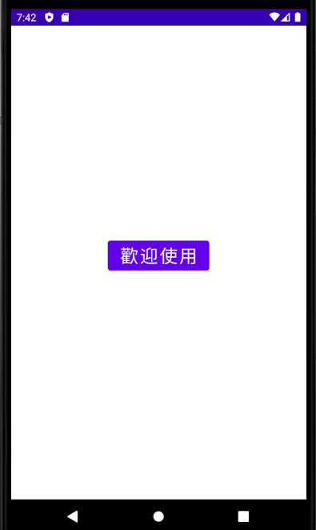

步驟二、會自動導入預設的登入畫面

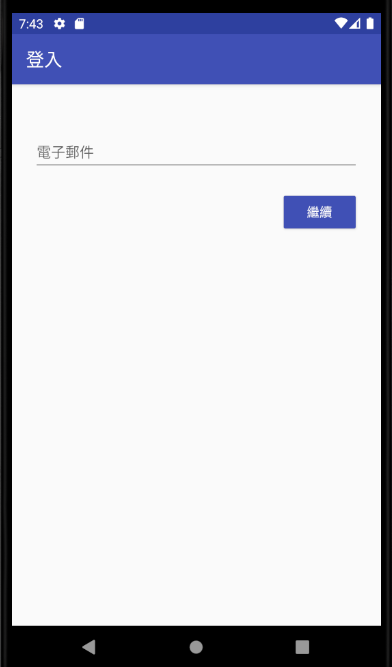

步驟三、若信箱沒註冊過，會要你輸入名字及密碼

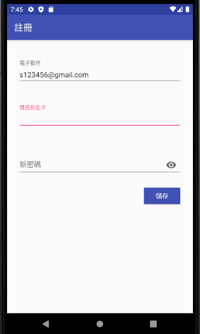

步驟四、註冊完後需要信箱驗證，點【發送電子郵件】

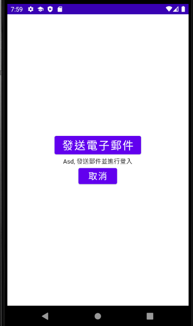

步驟五、此時會傳送驗證連結到你的信箱，請自行至電子郵件點選連結，
之後返回APP再進行一次登入即可進行查詢

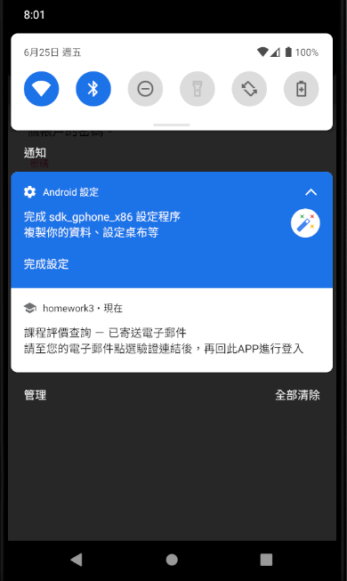

步驟六、之後開啟程式只要沒有登出都會開啟搜尋畫面，不會叫你登入了

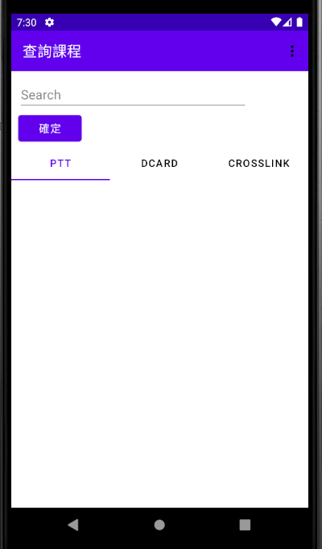

步驟七、只要搜尋一次就會幫你查三個三個網站的資料，三個網站都只搜尋一頁的資料
(dcard因為是動態網頁的關係，上限30筆)，但通常要找的課程資料也不會超過一頁

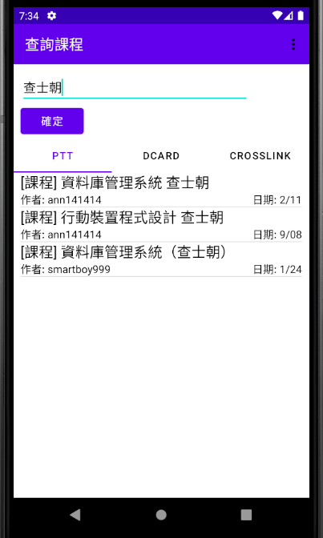

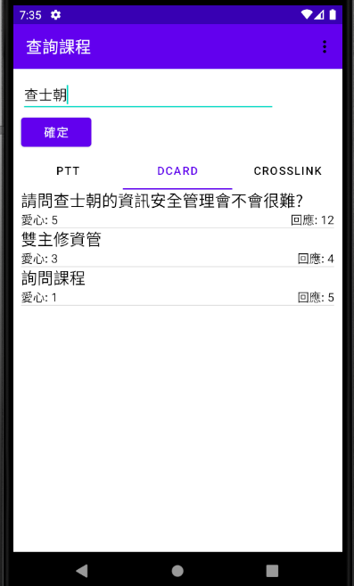

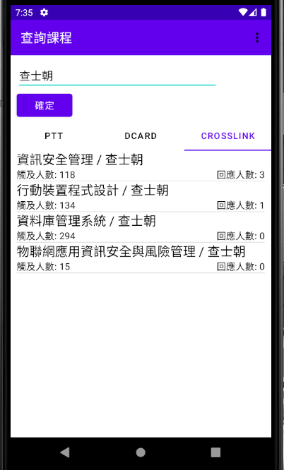

步驟八、點擊各項目會進入內容頁面，點擊右下角星星可以收藏，顯示黑色星星代表已收藏

PTT

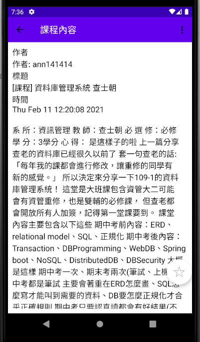
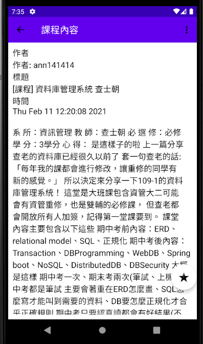

Dcard

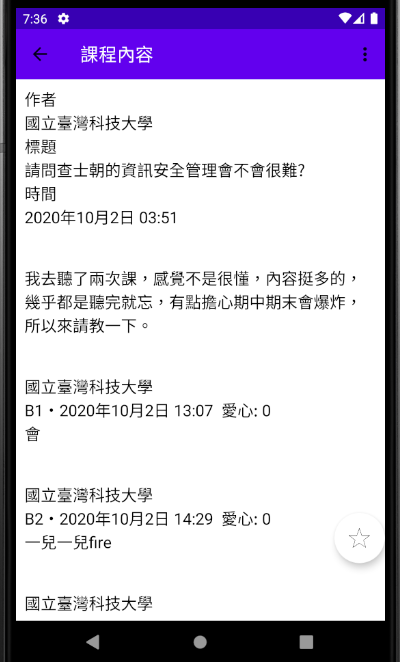

Crosslink，需要FB登入，點擊【連結至CROSSLINK】可直接開啟瀏覽器，進行FB登入後才能瀏覽內容

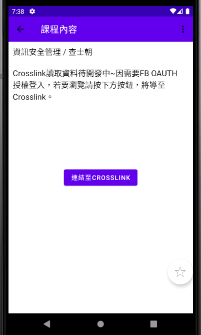
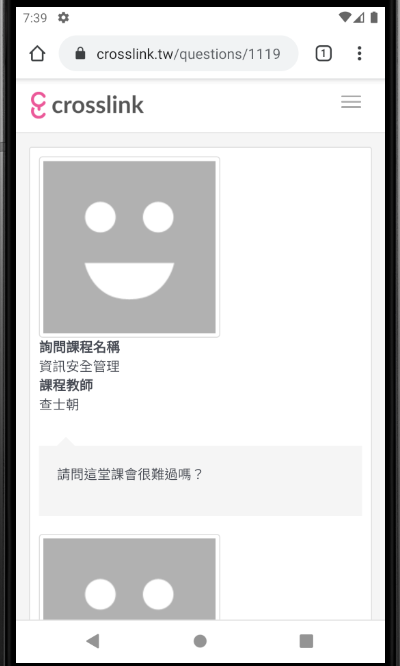

步驟九、【查看收藏】
(原本是設計資料會根據PTT、Dcard、Crosslink排序，
但是會導致搜尋頁面無法搜尋出結果，改成照收藏時間排序了)

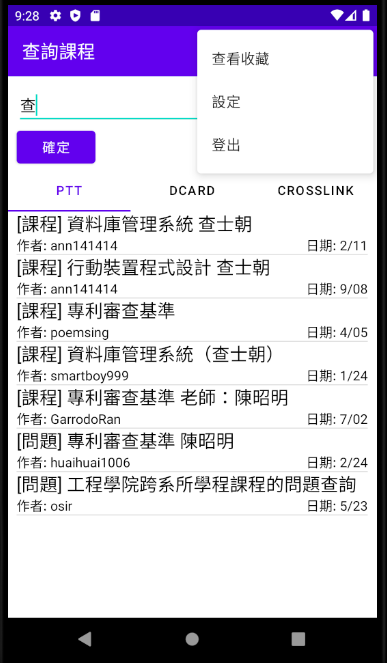
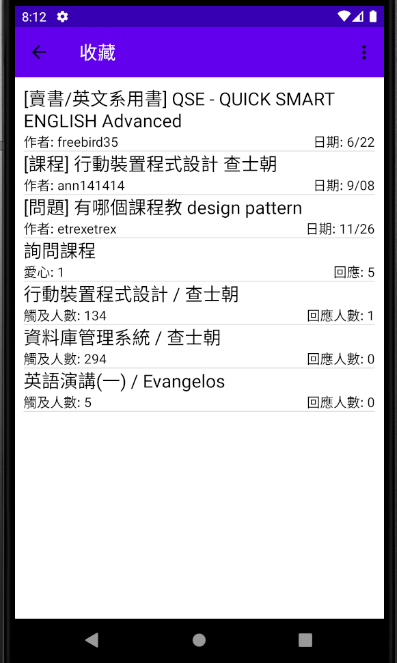

步驟十、【設定】調背景顏色為灰色，且關閉程式再開啟一樣維持灰色

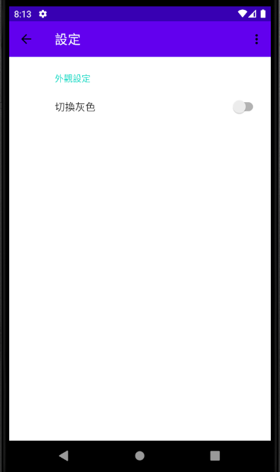
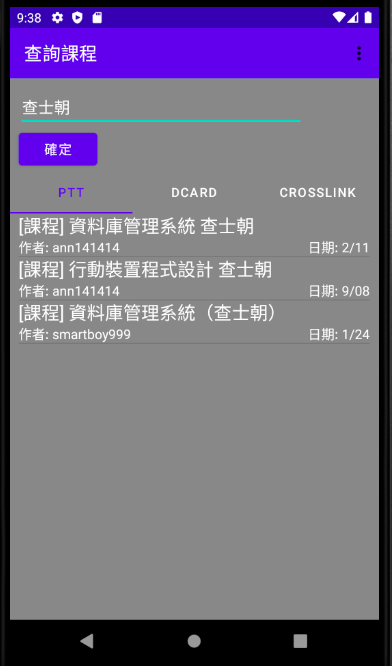
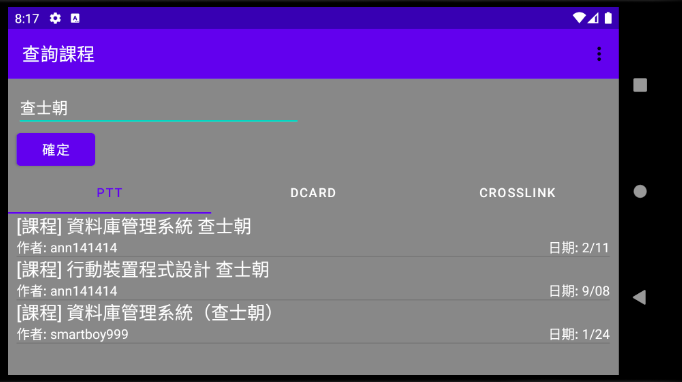
